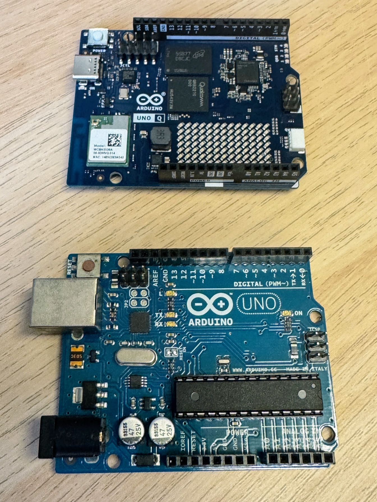
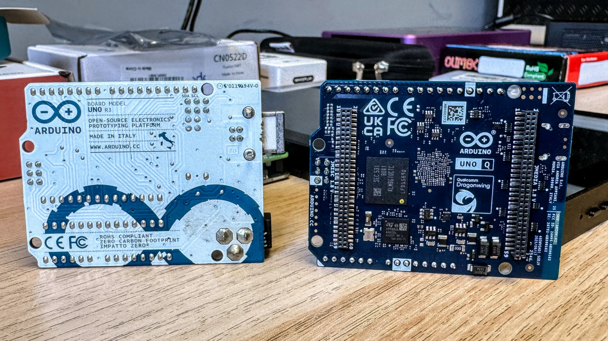
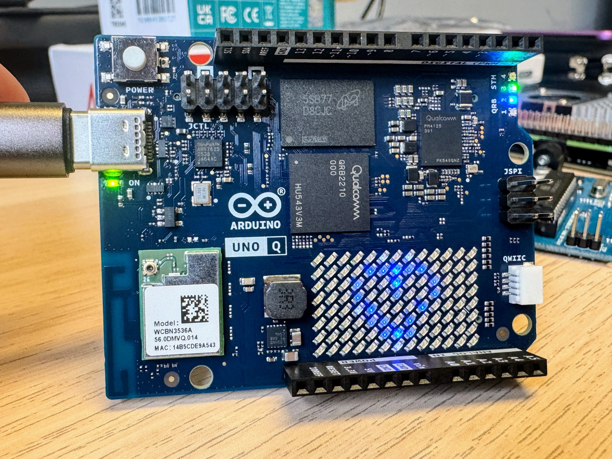
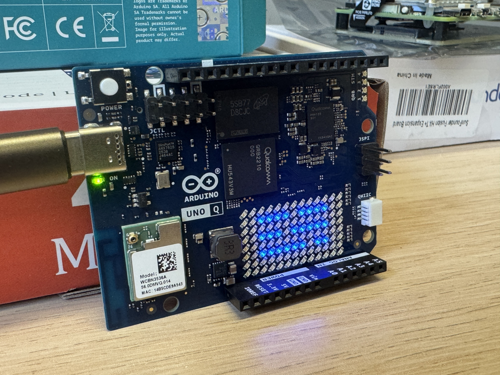

Last year, the venerable [Arduino](https://arduino.cc) - one of the OG Open Source maker companies of the past 20 years - was acquired by Qualcomm, and we were pretty uncertain what to expect. There's certainly been a lot of discussion about the drawbacks, and changes to the terms and conditions and such.

Nevertheless, we were intrigued by the [Arduino UNO Q](https://www.arduino.cc/product-uno-q) board(s) that were announced at the same time - the classic Arduino UNO board form factor, with microcontroller, but paired up with a Qualcomm processor capable of running full Debian Linux. They announced 2Gb and 4Gb versions, and Andy held off on getting one until the larger memory option was available.

During our first meeting in February, we had a bit of a play with the new Arduino board - and, we were reasonably impressed.

We did a double-take at the fact that the packaging is identical to the original! I guess it shouldn't have been too surprising, as it is the same footprint.

Quick photo opp for an original UNO R3 (with the socketed Atmel chip) alongside the UNO Q...

 

The pins being directly labelled is a nice touch, and that also makes more room for components on the board itself since the silkscreen doesn't include those markings. The connectors on the back of the board are curious - we will have to learn more about those in future.

It was pretty easy to get up-and-running - we connected over USB-C, opened the UNO Q starting web page (which used WebSerial to connect), ran through the setup process and onto the wifi, and got things updated. The update was the longest part of the process.

Plus, there's a cute Arduino logo animation and a [pulsing heart](https://loops.video/v/dK87rgqIfC) while it all gets setup.

After that, we decided to try some of the basic examples - for example, displaying air quality on the LED matrix, getting weather information, etc. (note, it was not foggy, just overcast).

The new model for interacting (Python code running in a container on the processor, talking to the Arduino sketch on the microcontroller) is interesting.

We didn't get around to trying out the Debian part of the module, as we'd forgotten a keyboard and mouse - something to fix for our [meetup this coming weekend](https://luma.com/mr59v66m).

Apart from checking out the new Arduino, we also resurrected an old laptop with Linux Mint; checked out a bricked UUGear Vivid Unit; and talked a lot about Home Assistant.

Sound interesting? Come along to HackWimbledon and get involved! We'd be happy to share what we're up to.

