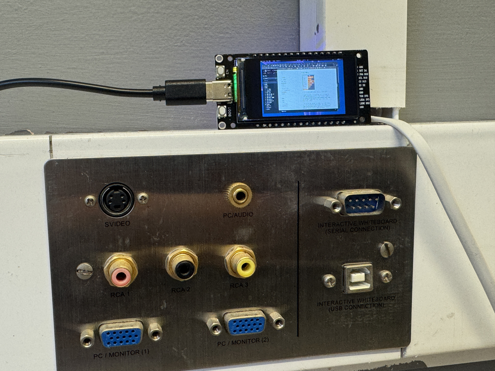

A small meetup this week, in more ways than one! [Andy](https://andypiper.me) had seen some articles about [using an ESP32-powered LCD as a miniature monitor](https://www.cnx-software.com/2026/02/09/add-a-tiny-desktop-monitor-to-your-pc-with-the-esp32-desktop-monitor-project/) but he had not been able to get the exact model of devboard mentioned, and ended up with a slightly larger 1.9" screen instead of the 1.14" model. It turns out that the [original code](https://github.com/tuckershannon/ESP32-Desktop-Monitor) was (probably?) written for Windows, as well, so he had to jump through some hoops with Python, Wayland, and desktop portals to get things to work.

So - most of this week's meetup was mirrored via Wifi to a teeny, tiny, display sitting over on the wall, underneath the big screen where we had the A/V setup for remote participants...If this was impractical, you weren't trying hard enough to see it...

Apart from that, we also worked on some tweaks to the branding, which is now more consistent across the site and socials. Neil and Barry are off to [the Raspberry Pi birthday event at CamJam](https://www.eventbrite.co.uk/e/cambridge-raspberry-jam-28th-february-2026-raspberry-pis-14th-birthday-tickets-1979660510879) in a couple of weeks, and will be armed with a pop-up banner, stickers, and cards all with the fancy improved logo - so go and say hello!

We've also been working on improving social connections. Andy made [a "Starter Pack" of Fediverse accounts](https://fedidevs.com/s/OTEx/) of some other known UK + Ireland hackspaces, maker events etc. If yours is not on the list, the Mastodon / Fediverse account is probably set to non-discoverable; just flip that option in account settings and let him know, so he can add you to the list.

(talking of which, Cambridge Makespace doesn't seem to be on Mastodon, sadly!)

Separately from the artwork and logo, Neil spent some time soldering connections... for his new Pico-powered KMK keypad, which worked first time! 🎉

Finally - Barry and Andy will be heading to the [Home Assistant meetup in London](https://luma.com/rqbermeo) on Feb 25th, and may meet you there... it looks fully booked, but it might be worth trying the waitlist if you're interested.

Related - we've added a [small page of maker-adjacent events](/events) here, to help to keep track of the things we know about.

Don't forget to [follow us on Lu.ma](https://luma.com/hackwimbledon), and get on the list for one our both of our meetups in March. See you then.
