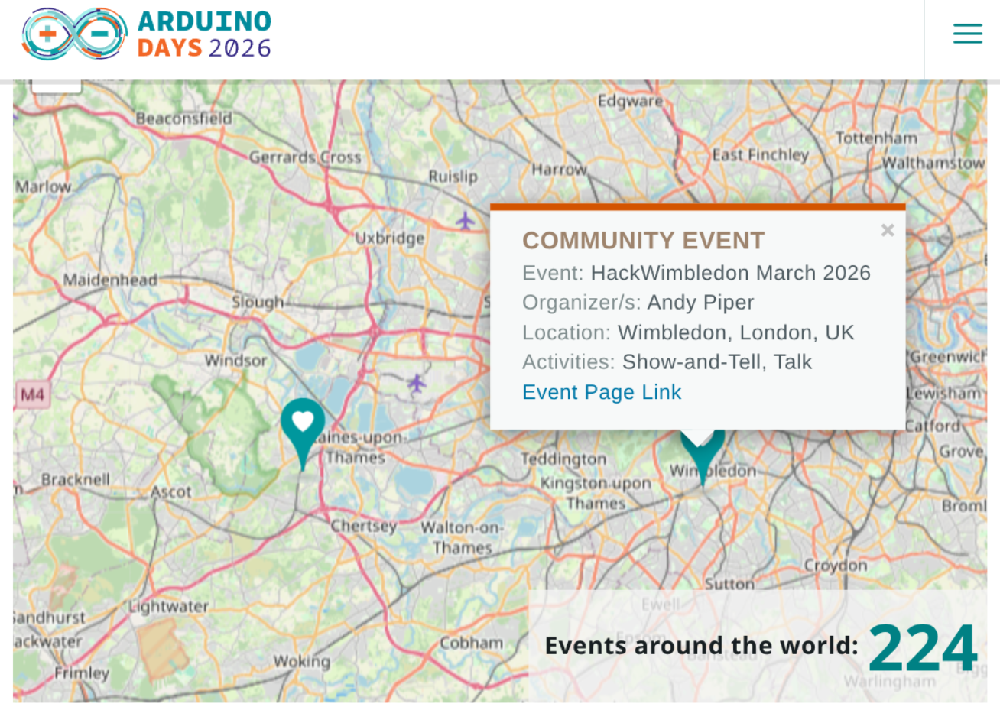

On Sunday 29th March, we have [our Arduino Days event](https://luma.com/ao2b7ovs). Technically it is just after the [official Arduino Days](https://days.arduino.cc/about) which are on March 27-28, but we already had our meetup scheduled for the 29th, so we thought we'd go with it.

As always, this is a free event, open to all. We do ask you to have a look at [the About page](https://hackwimbledon.org/about/), particularly the _How it works_ and _Can I join?_ sections, to get an idea of what we do and how we operate. We also ask that you register for the event via the link above, so we can get an idea of numbers and plan accordingly. If you're under 18 we'll ask you to come with a parent or guardian. We also encourage you to bring your own laptop and/or Arduino hardware if you have it, but we will have a few things available for use on the day.

We're been [interested in the UNO Q lately](https://hackwimbledon.org/news/2026-02-10-uno-q/), and have been tracking other Arduino announcements such as the forthcoming VENTUNO Q board. We also have the Arduino Alvik robot, the Nesso N1, the Matter-compatible Nano, and more to talk about.
