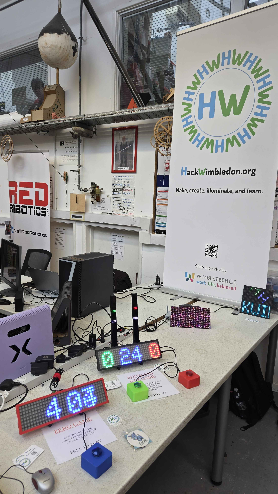
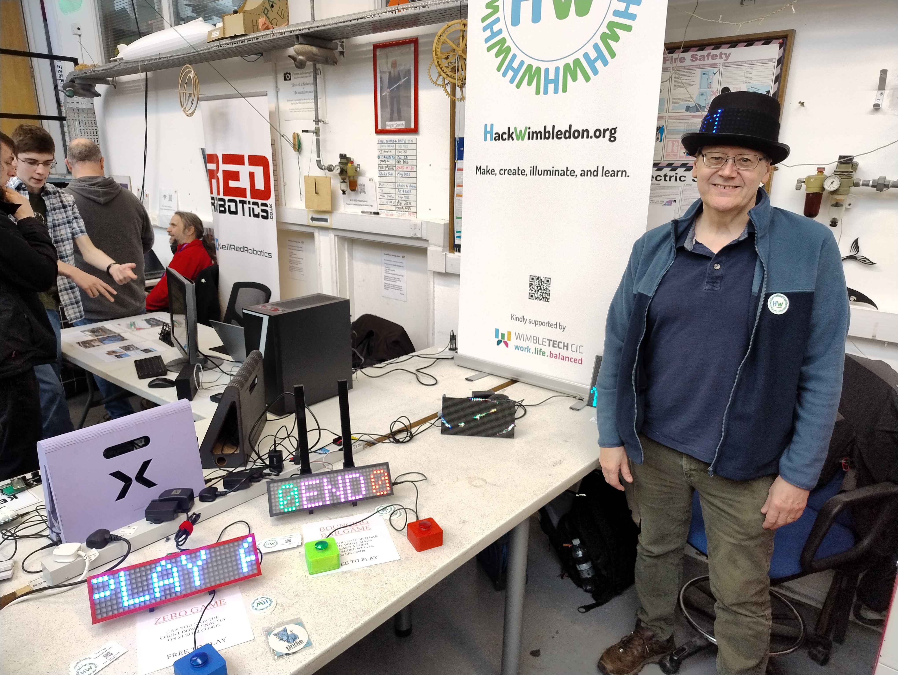
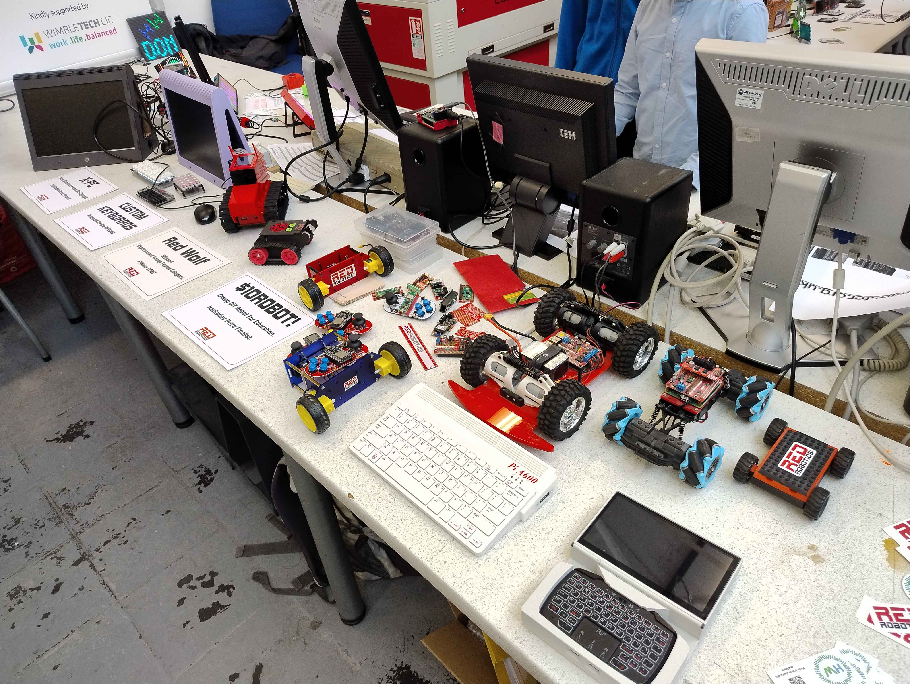
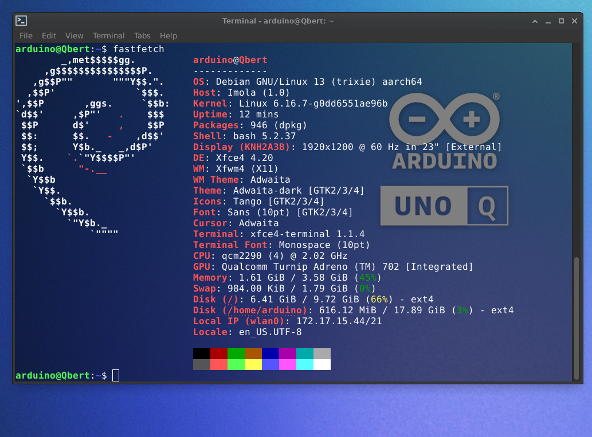
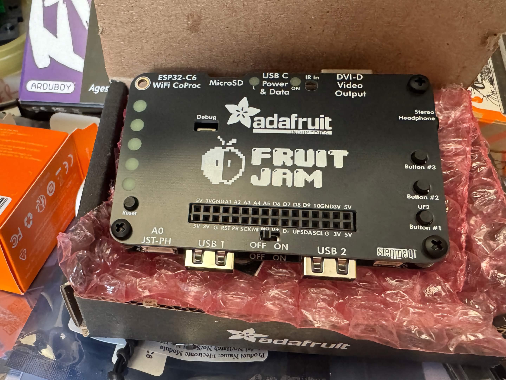
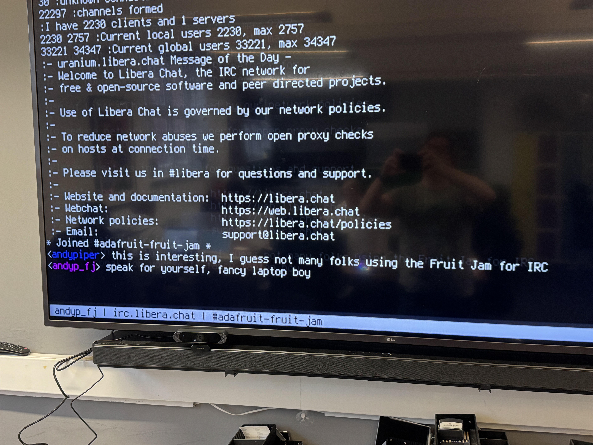
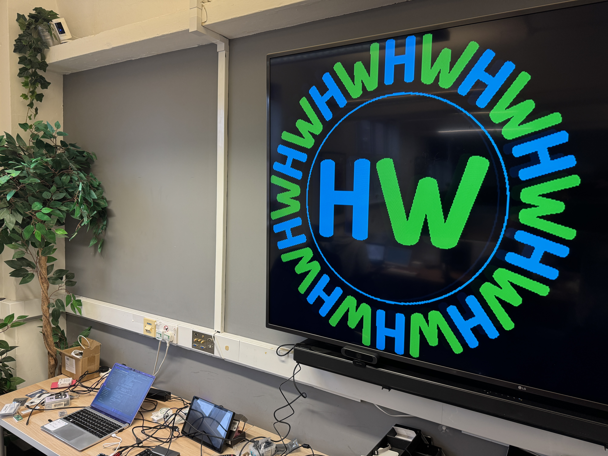

A quick update on what's been going on in the last few weeks, and what's coming up...

Firstly, Barry and Neil went to Cambridge for the CamJam Raspberry Pi birthday event on Feb 28th, and had a great time chatting to people about our meetup, and sharing some of their projects.

The first March meetup was fun! We did some more with the Arduino UNO Q, this time getting into the Debian Linux side of things.

Also, we had a play with the Adafruit Fruit Jam, which is now finally available in the UK [via Pimoroni](https://shop.pimoroni.com/products/adafruit-fruit-jam-mini-rp2350-computer?variant=56103038419323). It's a cute board based on the RP2350 with a lot of useful extras. We did some old school IRC, and managed to get it to put our logo on the screen.

Coming up, we have an [Arduino Days event next Sunday](https://luma.com/ao2b7ovs) (more in [the next post](https://hackwimbledon.org/news/2026-03-22_arduino_days/)). You can also have a look at the [events calendar](https://hackwimbledon.org/events/) for third party events that we think might be of interest to our members. Hope to see some folks at [Electromagnetic Field](https://emfcamp.org) in July!
