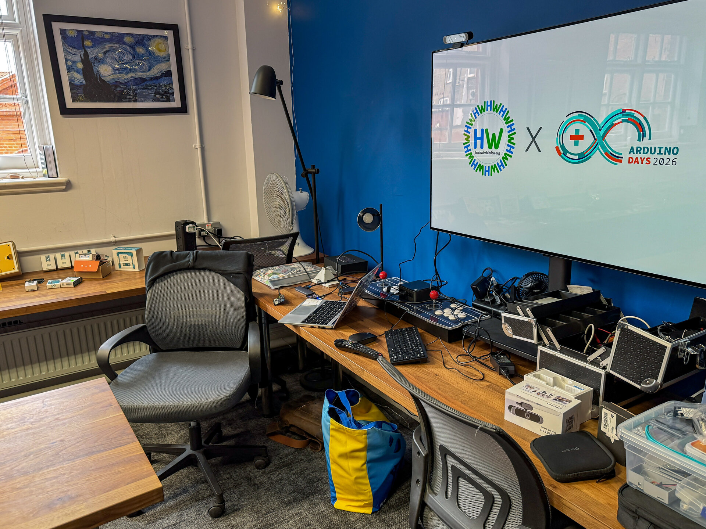
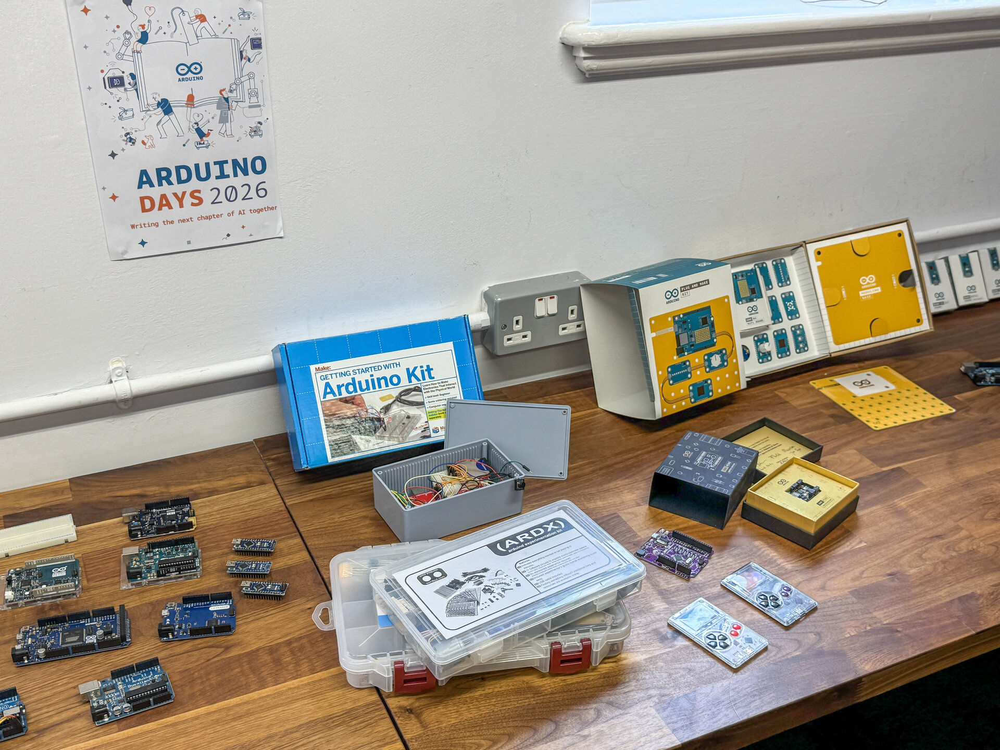
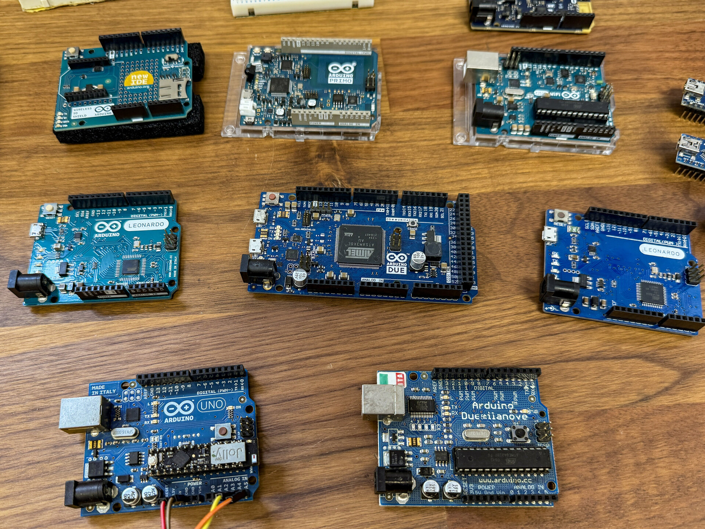
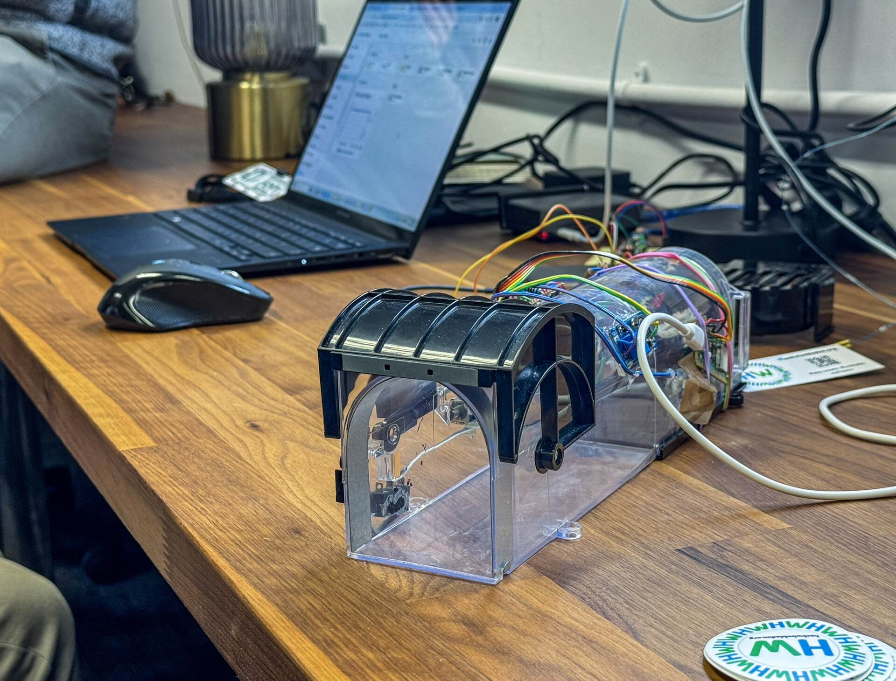
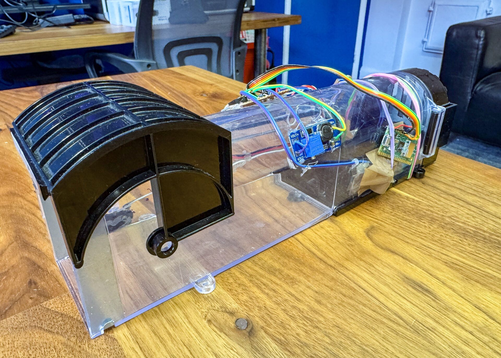

We had a great event on Sunday - our #ArduinoDays26 event at HackWimbledon. It was great to meet some new folks and to see some familiar faces as well.

It wasn't only about Arduino, though...

<!--more-->





We had a display of current Arduino products including the [UNO Q](https://hackwimbledon.org/news/2026-02-10-uno-q/), and we also had something of a "museum" of older Arduino boards, so that folks could explore. It was fascinating to see how far things have come since the early days of Arduino.

Andy gave a talk that covered a little bit of the history of Arduino (celebrating 21 years) and their earliest experiences with the platform, as well as some of their older projects like [Flogr](https://github.com/andypiper/fsc_flogr), a GPS-enabled field data recorder from all the way back in 2012.

You can grab the slides from the talk [here](https://hackwimbledon.org/files/ArduinoDays26.pdf).

There was a good discussion about the current state of the Arduino ecosystem, and the [announcements from the main Arduino Days events](https://blog.arduino.cc/2026/03/27/we-just-announced-seven-new-products-ready-to-expand-your-arduino-uno-q-board/).

We also had a couple of demos. Neil had a fun project showing a self-balancing robot - not technically built using Arduino, but coded using the same tools. It was great to see the robot in action, and to learn a bit about how it works.

<video controls width="100%">
  <source src="images/balance.mp4" type="video/mp4">
  Your browser doesn't support HTML5 video.
</video>

Finally, Jon showed off his latest project - a humane mousetrap that was just a little bit juiced up with a Pi Pico, a very large capacitor, and a solenoid. Oh, and a laser tripwire (OK, an LED tripwire, but it was very cool).





Lots more coming up, so keep an eye on the [Luma events page](https://lu.ma/hackwimbledon) for our next meetups in April and May.
