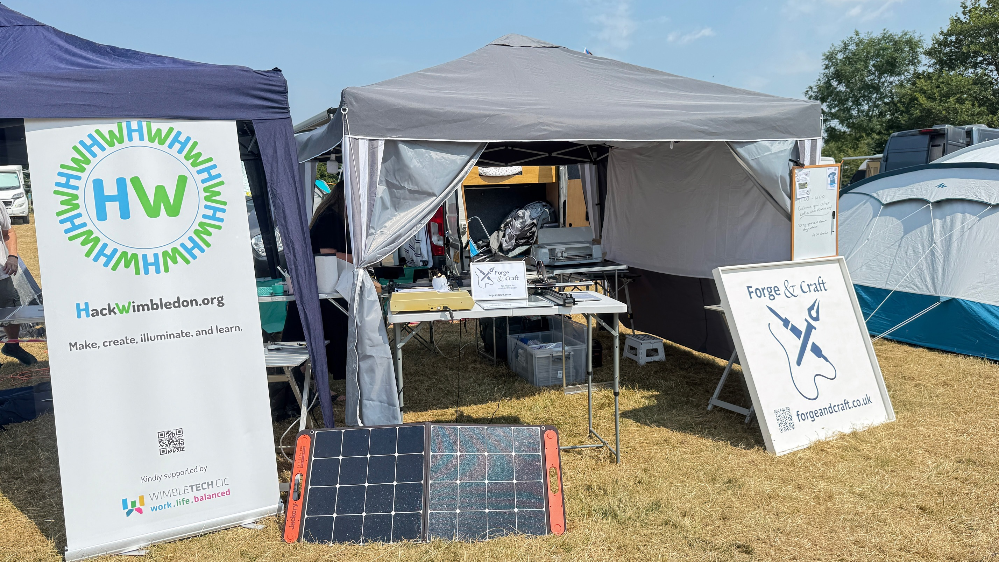

It's the end of July, and time for a quick update on what we've been up to recently.

Back in June, Andy popped up to Leicester to check out the [Retro Computer Museum](https://www.retrocomputermuseum.co.uk/) for their [Awesome Legendary Gathering](https://retrocomputermuseum.co.uk/events/legendary-gathering-20-06-26/). Top tip - RCM is a fantastic place to see some of the history of computing, and try out some of the old machines. The Library they have there is really cool! It's well worth a visit if you're in the area.

## Electromagnetic Field 2026

The big event of the summer was, of course, [Electromagnetic Field](https://emfcamp.org) in July. HackWimbledon had a small presence at the camp, with Andy and Barry attending. We had a small village with Andy's [Forge & Craft](https://forgeandcraft.co.uk) studio. Andy also went along to a meetup for directors of the UK maker spaces. We were really sad to hear that [Richmond MakerLabs](https://www.richmondmakerlabs.uk/) is having some challenges, but have met a couple of nice folks from there lately.

There was way too much to see and do at EMF, as usual. We had a great time, and hopefully a few more folks became aware of HackWimbledon and what we do as a result of seeing our banner or grabbing some of our stickers.

## Looking ahead

We're continuing our [HackWimbledon meetups](https://hackwimbledon.org/meetings/) every couple of weeks, so check on [Luma](https://luma.com/hackwimbledon) for the next ones in August (we'll add dates for September soon). We've met some fantastic new people recently!

There are [more things](https://hackwimbledon.org/events/) to check out, as well. Here a few highlights:

- Locally, Kingston University is hosting the second [showcase of the Archive of Retro Computing](https://arcatku.org/event/arc-annual-showcase-event-2026) from August 5th to 11th. [Andy wrote about his visit last year](https://andypiper.co.uk/2025/08/25/retro-tastic/). It's a fun thing to explore! We're excited that they will have a permanent home for the archive in the future.

- In September, [Liverpool Makefest](https://liverpoolmakefest.org/) is back! Andy and Neil have both exhibited there before. It has a new home this time - DoES Liverpool - which also makes it a good opportunity to check out their coworking and maker space.

- Our friend Spencer of [RC2014](https://rc2014.co.uk) fame is running [RC2014 Assembly 2.0](https://www.eventbrite.co.uk/e/rc2014-assembly-20-tickets-1992559683652") at Bletchley Park at the end of September. We didn't get a chance to visit last year, but we hope to make it this time around.

---

That's all for now, but keep an eye on the website and our [Luma events](https://luma.com/hackwimbledon) for more updates. We hope to see you at one of our meetups soon!
